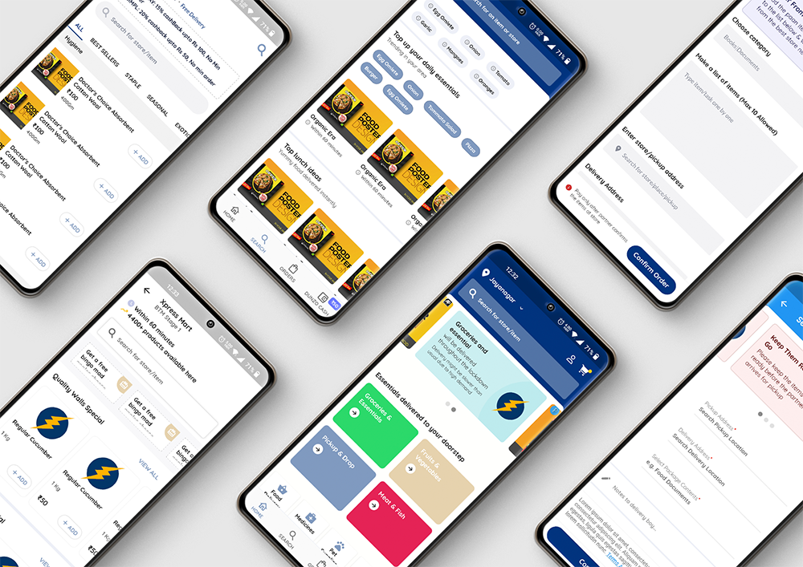
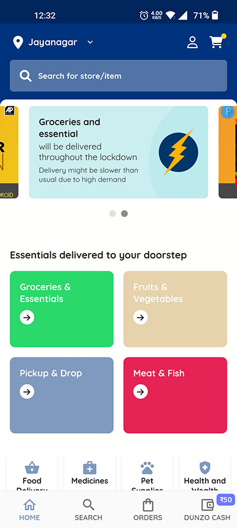
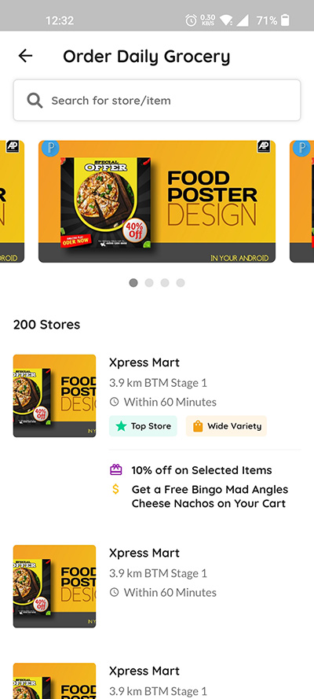
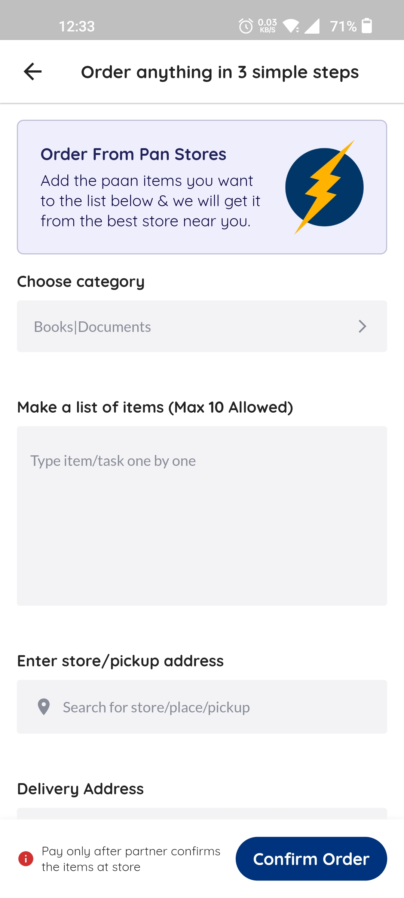
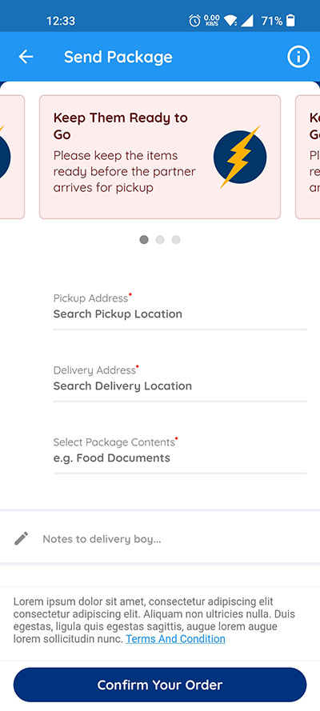
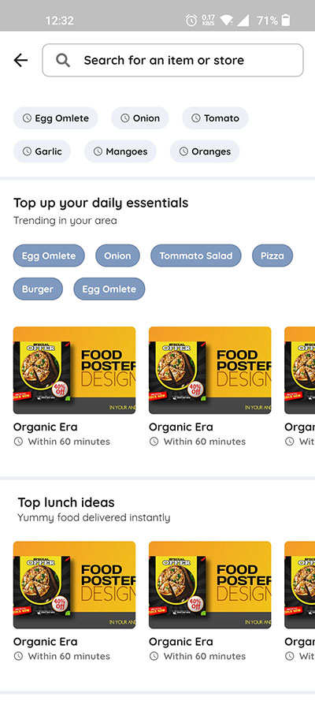
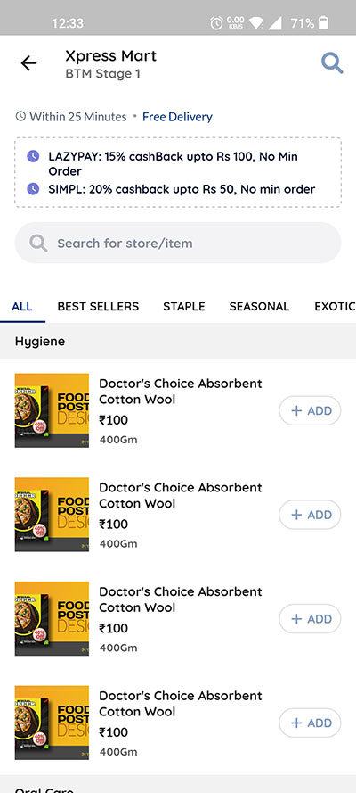
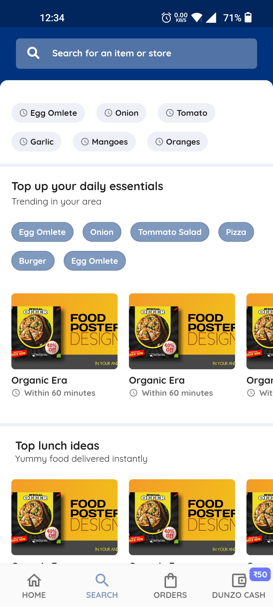
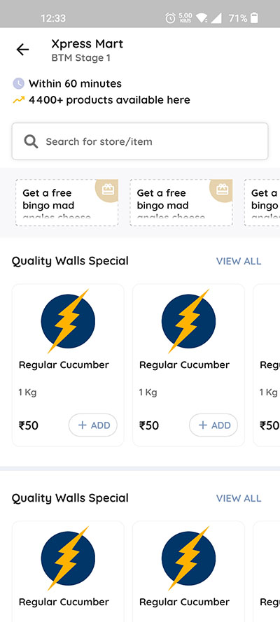
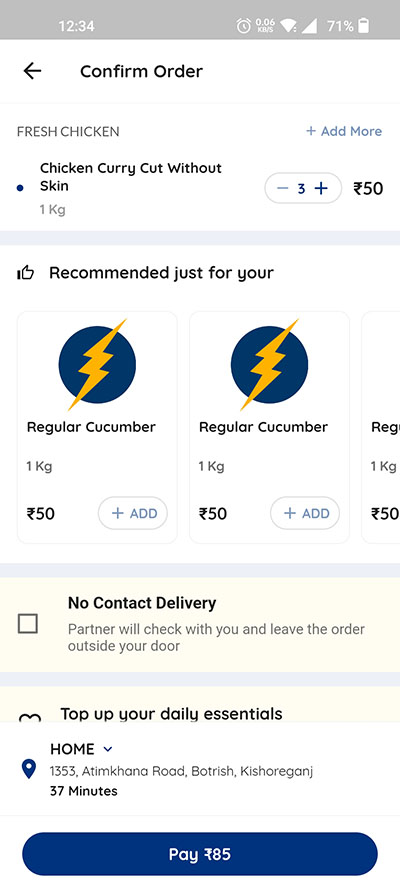

# Dunzo UI Clone

Dunzo UI clone app built with Dart & Flutter framework for Android & IOS.

### Support this project

  

## Screenshots

  &nbsp;  &nbsp;  &nbsp; 
 
  &nbsp;  &nbsp;  &nbsp; 
 
  &nbsp;  &nbsp;  
